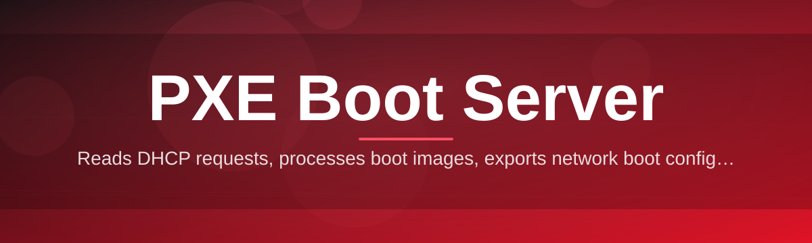

# pxe-boot-server-manager 🖧🚀

  

*Turn any Windows machine into a network boot hub — no server room required.*

## 🌐 Overview

Network booting has always lived at an odd intersection of "essential" and "obscure." Every IT closet eventually needs to re-image a lab full of machines, stand up a rescue environment, or deploy an OS to hardware that doesn't even have a hard drive yet — and every time, someone rediscovers that PXE (Preboot Execution Environment) is simultaneously one of the oldest and most fragile protocols still in daily use. DHCP options, TFTP block sizes, boot file paths, architecture detection — the failure modes are legendary, and the tooling has historically demanded a Linux box, three config files, and a prayer.

**pxe-boot-server-manager** exists to collapse that entire stack into a single Windows application. It bundles a DHCP/proxyDHCP listener, a TFTP file server, and a boot menu orchestrator into one process, wrapped in an interface that tells you *what* is happening on the wire in real time instead of hiding it behind syslog entries. The goal isn't to reinvent network booting — it's to make the existing PXE boot server workflow observable, debuggable, and approachable for people who don't want to become full-time network engineers to re-image a laptop fleet.

This project is built for sysadmins managing bare-metal deployments, homelab tinkerers spinning up diskless clients, classroom and lab administrators who need repeatable imaging, and open-source contributors who think boot infrastructure tooling deserves the same design care as everything else in 2026. Whether you're serving WinPE, a Linux installer, or a custom iPXE chain, the manager gets out of your way once the lease hits the wire.

## 🎯 Overview & Purpose (Why This Exists)

> [!NOTE]
> This section explains the *design philosophy*, not a feature checklist — that comes next.

Most PXE tooling was written for servers that stay running for years. This project assumes the opposite: a technician's laptop that gets opened for twenty minutes, boots a rack of machines, and gets closed again. Every architectural decision — the single-binary packaging, the live log view, the zero-config defaults — flows from that one assumption.

  

## 🧩 What's Under the Hood

The manager isn't a thin wrapper around existing daemons — each piece was designed around the specific pain points people hit when running a **PXE boot server** on Windows, where the native network stack fights you at every turn.

- **Proxy DHCP mode by default** — runs alongside your existing DHCP server instead of replacing it, so you never have to touch production network infrastructure just to test a boot image.

- **Architecture-aware boot menus** — detects BIOS vs UEFI vs ARM64 client requests at the DHCP handshake and serves the correct bootloader automatically, instead of making you maintain three separate boot files by hand.

- **Live packet timeline** — every DHCP offer, TFTP read request, and boot file transfer shows up in a scrolling, filterable log so you can see *exactly* where a stuck client is failing instead of guessing.

- **Drag-and-drop image staging** — drop an ISO, WIM, or boot folder onto the window and the manager extracts and wires up the correct TFTP root structure without manual path editing.

- **Multi-client throughput shaping** — TFTP block size and window settings are tuned per-session, so imaging twenty machines simultaneously doesn't collapse into timeout retries.

- **Profile-based configurations** — save distinct boot setups (Windows deployment, Linux installer, diagnostic rescue) and swap between them in one click rather than re-editing config files.

- **Firewall-aware startup checks** — the app detects common blockers (Windows Firewall, conflicting DHCP services, port 67/69 contention) before you even hit start, surfacing the fix instead of a cryptic bind error.

- **Portable, dependency-free execution** — a single executable, no runtime installs, no background services left behind when you close it.

> [!TIP]
> Running alongside a corporate DHCP server? Leave the manager in proxy mode — it answers only the PXE-specific options and lets the real DHCP server keep assigning IPs.

---

## 🏁 Getting Started

Getting a boot session running takes minutes, not an afternoon of config file archaeology.

1. **Visit the landing page** and grab the latest build — the button above and below both point to the same release page.

2. **Run the executable** — no installer, no admin wizard. Windows may prompt for elevated permissions since the app binds to network ports.

3. **Point it at a boot image** — drag an ISO/WIM onto the window, or select a profile you've configured previously.

4. **Start the service and boot a client** — set the target machine to network boot in its firmware, and watch the request appear live in the manager's log pane.

> [!IMPORTANT]
> Only one DHCP/PXE responder should be authoritative for boot options on a given subnet. If another PXE service is already running, switch this tool to proxyDHCP mode to avoid lease conflicts.

## 💻 System Requirements

| Requirement | Details |
|---|---|
| OS | Windows 10 or Windows 11 (64-bit) |
| Dependencies | None — fully self-contained executable |
| Network | Wired Ethernet strongly recommended for PXE clients |
| Permissions | Administrator privileges (for binding DHCP/TFTP ports) |
| Disk | Minimal — boot images stored wherever you point the tool |

## ⚙️ How It Works

The architecture is intentionally linear — a request comes in, gets classified, and gets answered, with the manager narrating every step:

- A client firmware broadcasts a DHCP discovery request with PXE-specific vendor options set.

- The manager's listener recognizes the PXE tag and responds with boot server and filename information (either as the primary DHCP server or in proxy mode alongside one).

- The client then issues a TFTP request for the initial bootloader, which the manager serves from its staged image directory.

- The bootloader chain-loads the appropriate boot menu or OS installer based on detected client architecture.

- Throughout the exchange, every packet and decision point streams into the live log so you can trace a failure back to the exact stage it occurred.

## 🔧 Troubleshooting

<strong>Client shows "PXE-E53: No boot filename received" — what now?</strong>

This usually means the DHCP offer arrived without the required boot filename option. Confirm the manager is actually running in an authoritative role (or proxy mode, paired with a working DHCP server) on the same subnet as the client.

<strong>The boot menu appears but hangs at "Loading files"</strong>

Almost always a TFTP timeout caused by an aggressive firewall rule or a block size mismatch with older firmware. Try lowering the TFTP block size in settings and re-checking Windows Firewall's inbound UDP rules for port 69.

<strong>UEFI clients fail to boot but BIOS/legacy clients work fine</strong>

UEFI firmware requests a different bootloader architecture than BIOS clients. Verify your boot image directory actually contains the UEFI-compatible loader — the manager will warn about this at startup if it's missing.

<strong>Multiple machines booting simultaneously slows to a crawl</strong>

Enable multi-client throughput shaping in settings; it staggers TFTP window sizes across concurrent sessions instead of letting them compete for the same bandwidth ceiling.

<strong>Nothing shows up in the log at all when a client boots</strong>

Check that another service (Windows Deployment Services, a router's built-in DHCP relay, etc.) isn't already claiming port 67. Two responders on one subnet is the single most common cause of total silence.

> [!WARNING]
> Running an unintended DHCP server on a shared or production network can disrupt every device on that subnet. Always confirm proxy mode is enabled unless you specifically intend to be the authoritative DHCP responder.

## 🎨 UI / UX Details

The interface leans into clarity over density — you should be able to glance at it mid-imaging-job and know exactly what's happening.

- **Keyboard shortcuts**: `Ctrl+S` start/stop service, `Ctrl+L` clear log, `Ctrl+,` open settings, `F5` refresh client list.

- **Themes**: Light, Dark, and a high-contrast mode built for dim server-room monitors.

- **Live filters**: toggle DHCP, TFTP, and error events independently in the log pane.

- **Session history**: past boot sessions are retained locally so you can compare a failing run against a known-good one.

---

## 🤝 Contributing & Community

This project grew out of shared frustration with brittle PXE tooling, and it stays healthy because contributors keep chipping away at edge cases none of us anticipated alone.

- Good first issues are labeled clearly — documentation, UI polish, and small protocol edge-case fixes are always welcome starting points.

- Open a discussion before large architectural changes so the design direction stays coherent across contributors.

- Bug reports with a packet log excerpt are worth their weight in gold — this domain lives and dies on trace-level detail.

  

> [!TIP]
> New to the codebase? Start with a good-first-issue ticket touching the log formatter or settings UI — it's the fastest way to understand the app's flow without touching the network stack directly.

## 📄 License

Released under the [MIT License](LICENSE), 2026.

## ⚠️ Disclaimer

This tool is provided as-is for legitimate network deployment, imaging, and diagnostic purposes. Running any DHCP or PXE boot server on a network you do not own or administer without authorization can disrupt connectivity for other devices. Use responsibly and only on networks where you have explicit permission.

---

  

